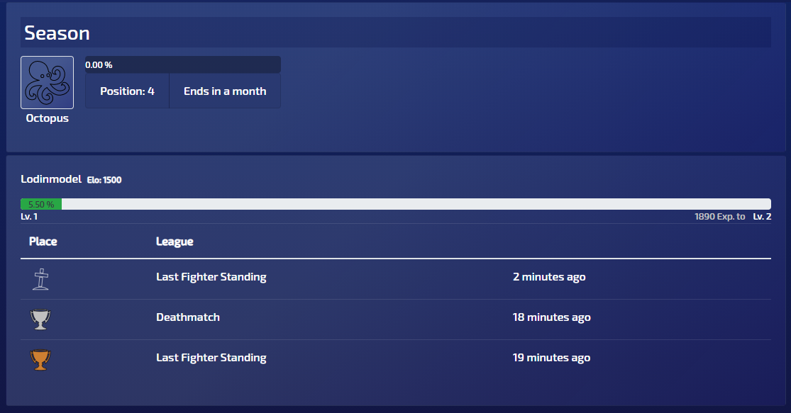
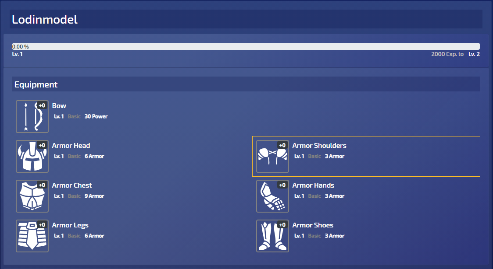
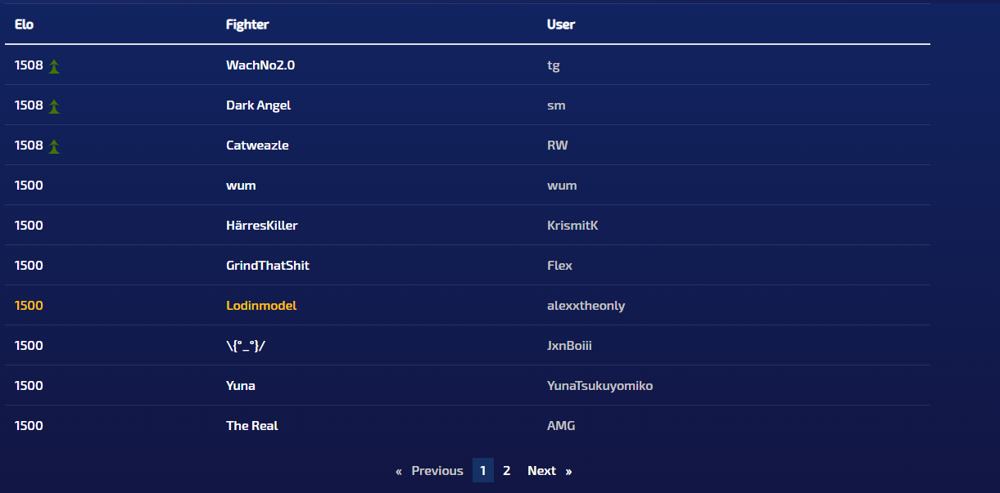
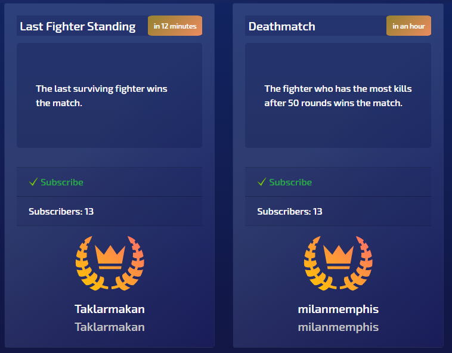
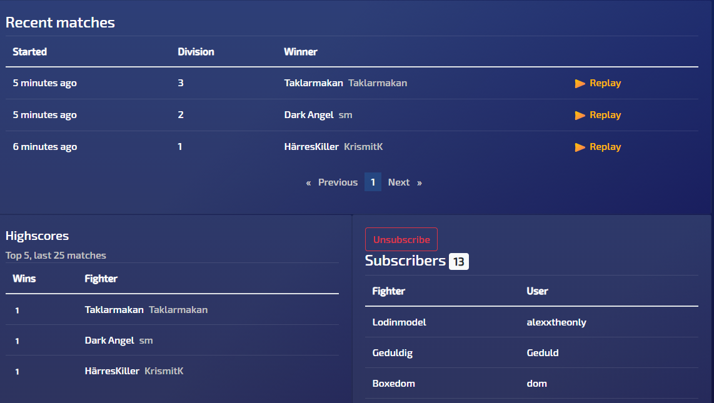
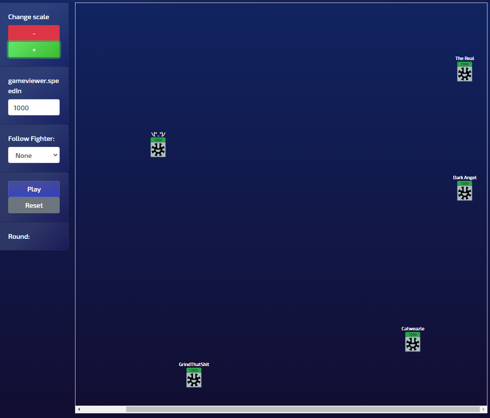
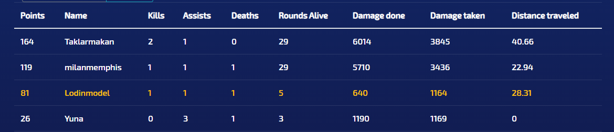
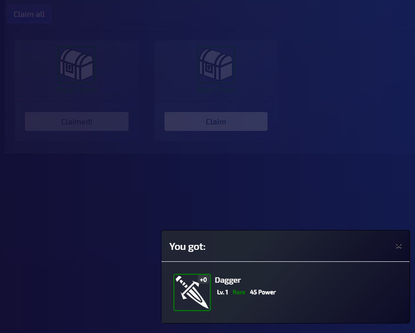
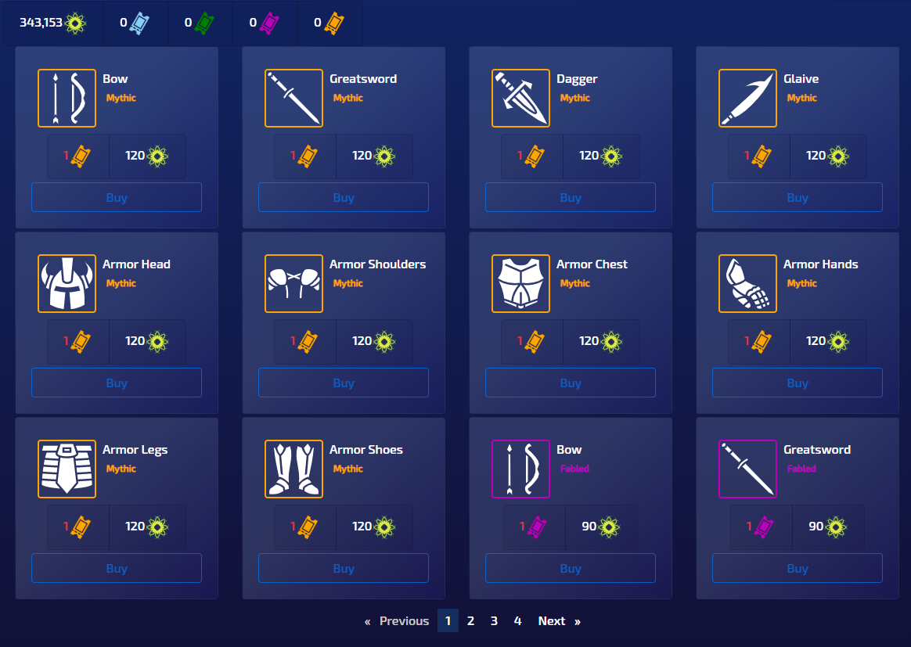
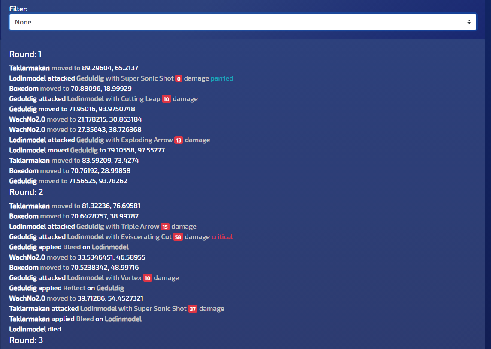

# EmpoweredPixels
Is a browser based automatic fighting simulator. You create, equip and train your own fighter, but he fights on his own.

Fighters are placed on a flat battlefield with weapons and armor, they attack, heal and flee all by themselves. 
Based on game mode the last standing fighter wins the match. 

Each match is part of a season that is active for roughly thirty days. When the season ends fighters will reset and a new season starts.
This is done to ensure new players have a chance at competing.

Fighting is calculated by https://github.com/Alexxtheonly/SharpFightingEngine. It handles:
* Combat
* Healing
* Movement
* Skill selection
* Fighter stats (Health, Damage, Armor)
* Maps
* Win and stale match conditions
* Features
  * Buffs (more power, regeneration, ...)
  * Conditions (burn, stun, ...)
  * Attunements (automatic application of buffs and conditions)

The equipment has different rarities, each rarity has better stats than the previous.  
Basic -> Common -> Rare -> Fabled -> Mythic -> Legendary

There are currently four weapons available:
* Dagger
*  Bow
*  Greatsword
*  Glaive

Each with unique skills and abilities.

The game is accessible here: https://empoweredpixels.dylf.de/
development is currently stale, however, it will be active again when motivation strikes.

# Impressions
**Dashboard**

**Fighter**

**Leaderboard**

**Leagues**

**League details**

**Match replay**

**Match results**

**Rewards**

**Shop**

**Combat log**

# Planned features
* Add skill selection
* Add account operations (delete, change password)
* Add map additions (zones: heal, burn, teleport)
* Update skill targeting (use actual projectiles, add support for area damage)
* Rework skills to display damage done, and applied conditions/healing
* Add alchemy (players cannot actively participate in this game, this would be a way to allow more participation without breaking the base concept)
  * Potions
  * Stun breakers
* Rework Combat log (use more icons, less text)
* Make fighter logic script able (allow players to script their own fighter logic)

# Contributing
I don't expect anyone contributing, however you are welcome to do so.   
If you have questions feel free to open an issue or email me.
